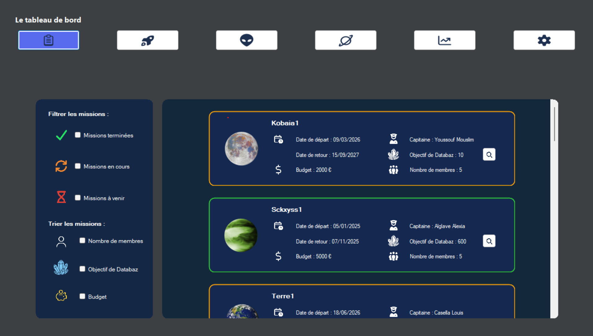
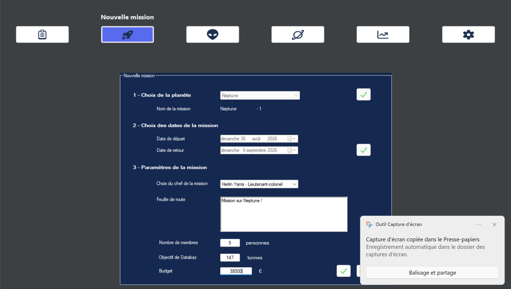
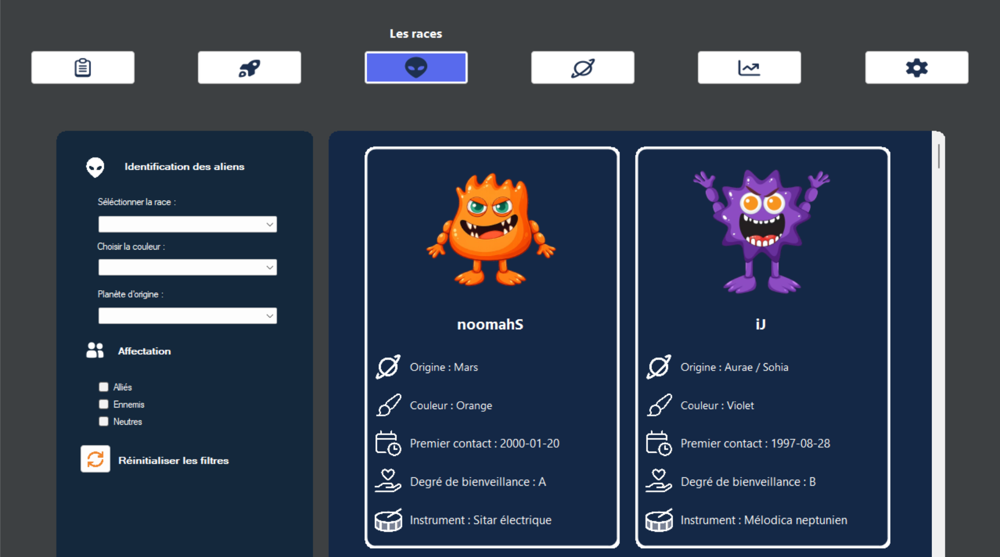
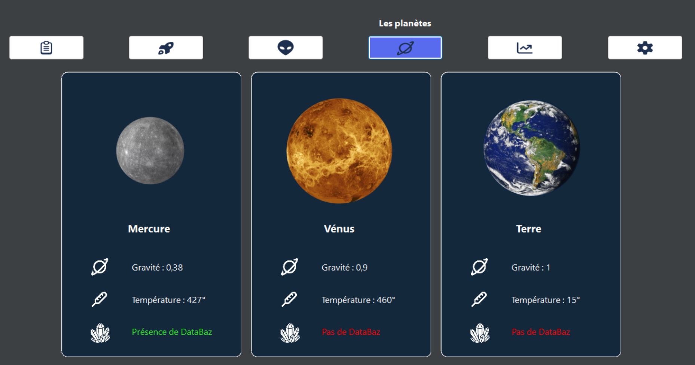
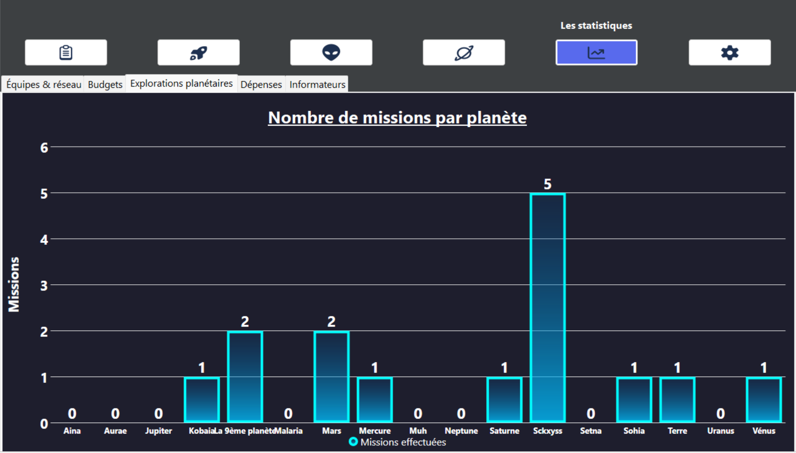
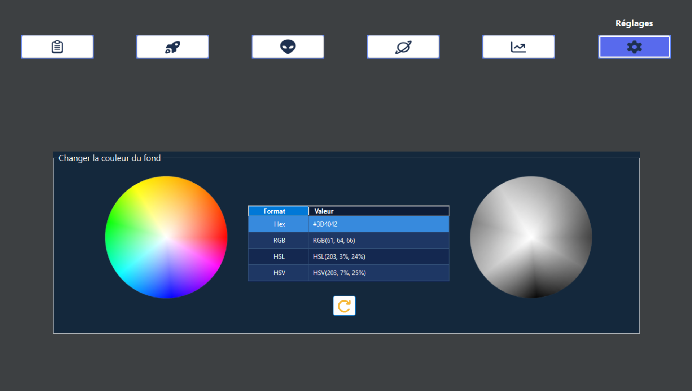
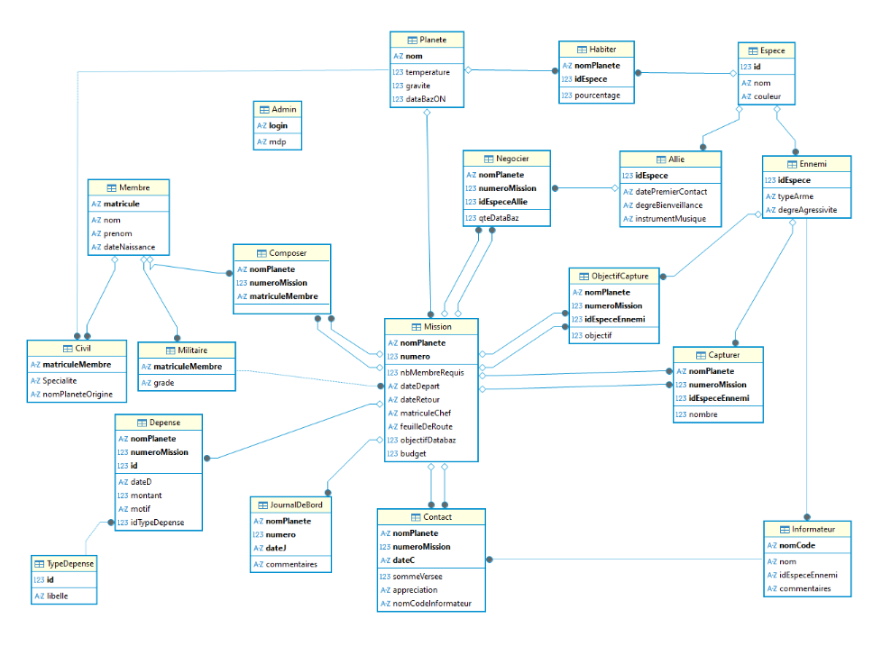

<!-- |-------------------------------------------------------------------------------------------| -->
<!-- |                                         LANGUAGE                                          | -->
<!-- |-------------------------------------------------------------------------------------------| -->
<div align="right">
  <a href="README.md">
    
  </a>
  <a href="README.en.md">
    
  </a>
</div>

<!-- |-------------------------------------------------------------------------------------------| -->
<!-- |                                          HEADER                                           | -->
<!-- |-------------------------------------------------------------------------------------------| -->
<h1 align="left">🛸 Stargate Management Game</h1>

<p align="justify">
This project is a space mission management application, developed in C#, as part of the Stargate project. The application allows managing the missions launched under the project: creating a mission, assigning a crew, defining capture objectives, tracking the budget and expenses, as well as a logbook recording contacts made with informants.
</p>

<p align="justify">
The application also offers a view of the recorded species in the galaxy, information on the planets, as well as a statistics page. Creating a new mission is restricted to administrators.
</p>

<!-- |-------------------------------------------------------------------------------------------| -->
<!-- |                                        PREVIEW                                            | -->
<!-- |-------------------------------------------------------------------------------------------| -->
## 📸 Preview

**Image of the dashboard:**
<div align="center">
  
</div>
<br>

**Image of creating a new mission:**
<div align="center">
  
</div>
<br>

**Image of the recorded species:**
<div align="center">
  
</div>
<br>

**Image of the planet information:**
<div align="center">
  
</div>
<br>

**Image of the statistics:**
<div align="center">
  
</div>
<br>

**Image of the background color customization:**
<div align="center">
  
</div>
<br>

<!-- |-------------------------------------------------------------------------------------------| -->
<!-- |                                        DATABASE                                           | -->
<!-- |-------------------------------------------------------------------------------------------| -->
## 🗄️ Database

<p align="justify">
All of the application's data is stored in a SQLite database named Stargate.db. It contains the following tables: Planete, Espece, Habiter, Allie, Ennemi, Membre, Civil, Militaire, Mission, Composer, Depense, TypeDepense, JournalDeBord, Contact, Informateur, Capturer, ObjectifCapture, Negocier and Admin.
</p>

<div align="center">
  
</div>
<br>

<!-- |-------------------------------------------------------------------------------------------| -->
<!-- |                                        USAGE                                              | -->
<!-- |-------------------------------------------------------------------------------------------| -->
## 🚀 Installation and running

<p align="justify">
To install and run the project, start by cloning the GitHub repository, then move into the project folder with the command cd Stargate-management-game. Then open the solution SAE24_Stargate.sln with Visual Studio. Once the solution is open in Visual Studio, run the project by pressing the F5 key on your keyboard or by clicking the green arrow at the top of the interface.
</p>

<!-- |-------------------------------------------------------------------------------------------| -->
<!-- |                                     ADMIN ACCESS                                          | -->
<!-- |-------------------------------------------------------------------------------------------| -->
## 🔑 Admin access

<p align="justify">
Creating a new mission is restricted to users with administrator rights. A test account is available:
</p>

|   Login   |   Password   |
|-----------|------------------|
| admin | &nbsp;&nbsp;&nbsp;&nbsp;&nbsp;admin |

<!-- |-------------------------------------------------------------------------------------------| -->
<!-- |                                    PROJECT STRUCTURE                                      | -->
<!-- |-------------------------------------------------------------------------------------------| -->
## 📁 Project structure

```text
Stargate-management-game/
├── Modeles/                   # Database connection and DataSet management
├── Properties/                # Project resources and settings
├── Resources/                 # Images used in the interface
├── Librairies/                # External libraries
├── SharpZipLib/               # Compression library
├── img/                       # Planet images and README images
├── Form1.cs                   # Startup form
├── frmLogin.cs                # Administrator authentication
├── frmChargement.cs           # Loading screen
├── ucVueTableauDeBord.cs      # Dashboard section
├── ucVueNvlMission.cs         # New mission creation section
├── ucVueAliens.cs             # Recorded species section
├── ucVueInfosPlanetes.cs      # Planet information section
├── ucVueStatistiques.cs       # Statistics section
├── ucVueParametres.cs         # Customization section
├── SAE24_Stargate.csproj
├── SAE24_Stargate.sln
└── README.md
```

<!-- |-------------------------------------------------------------------------------------------| -->
<!-- |                                     DEPENDENCIES                                          | -->
<!-- |-------------------------------------------------------------------------------------------| -->
## 📦 Dependencies

| Package | Usage |
|---------|-------|
| **BCrypt.Net-Core** | Password hashing and security |
| **LiveCharts** | Chart creation and data visualization |
| **LiveCharts.WinForms** | Chart integration in the Windows Forms interface |
| **LiveCharts.Wpf** | Chart integration in the WPF interface |
| **PdfSharp.MigraDoc.Standard** | PDF document creation and formatting |
| **PdfSharp.MigraDoc.Standard.DocumentObjectModel** | Management of PDF document structure and content |
| **PDFSharp.Standard** | PDF file generation and manipulation |
| **PDFSharp.Standard.Charting** | Chart creation for PDF documents |

<!-- |-------------------------------------------------------------------------------------------| -->
<!-- |                                      CONTRIBUTORS                                         | -->
<!-- |-------------------------------------------------------------------------------------------| -->
## 👥 Contributors

Work carried out in a trio as part of a project at IUT Robert Schuman.

<div align="center">

[](https://github.com/rmax3iu)
[](https://github.com/marwaaan212)
[](https://github.com/GalatiMaxime)

</div>
